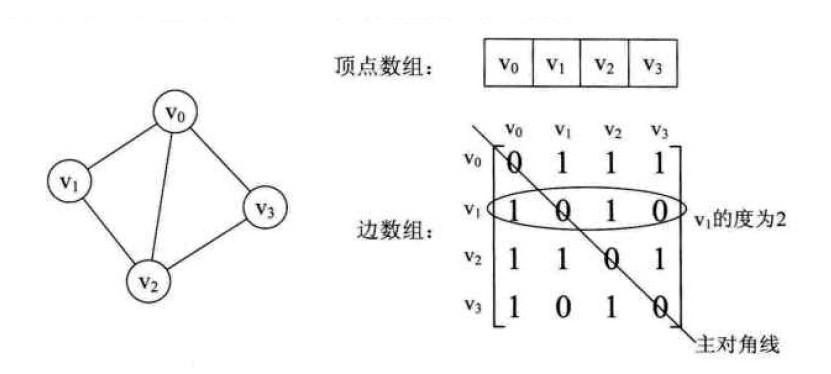

### 题目

* 给定无向连通图和m种不同的颜色。用这些颜色为图G的各顶点着色，每个顶点着一种颜色。是否有一种着色法使G中每条边的两个顶点有不同的颜色。这个问题是图的m可着色判定问题。 
* 若一个图最少需要m种颜色才能使图中每条边相连接的两个顶点着不同颜色，称这个数m为这个图的色数。 
* 求一个图的色数m称为图的m可着色优化问题。给定一个图以及m种颜色，请计算出涂色方案数。

### 分析

* 无向图转换成邻接矩阵， 将所有顶点横竖组成二维数组，如果两个顶点相连，则两个顶点确定的元素为1, 其他记为0

* 回溯法。涂的时候从颜色1开始到m，每当涂上一个色，判断这个点是否可以涂这个色，不可以的话就不再往下涂了，换成另一个颜色，可以的话就继续。
